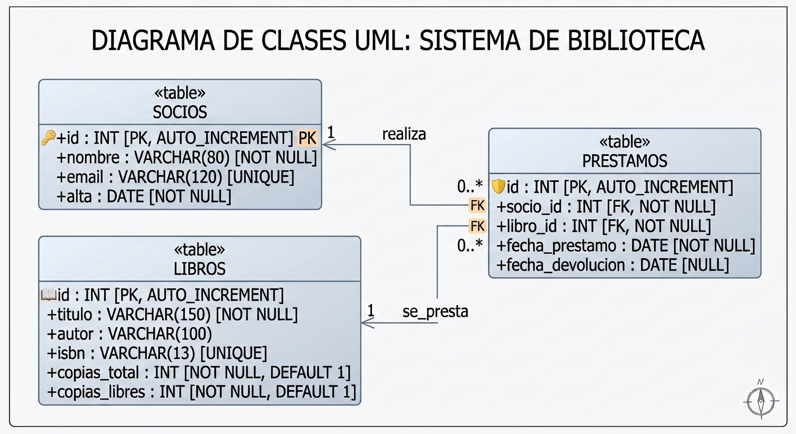

## Presentación de la unidad

### Qué aprenderás

En esta unidad las aplicaciones dejan de trabajar con datos efímeros y aprenden a **persistirlos** en una base de datos relacional y a recuperarlos de forma segura. Todo el acceso a datos se hace con **PDO** (PHP Data Objects), la capa de acceso a bases de datos de PHP.

### Objetivos

- Comparar las tecnologías de acceso a datos y justificar el uso de PDO.
- Conectar con MySQL/MariaDB mediante PDO, configurando el DSN y la gestión de errores por excepciones.
- Recuperar información con sentencias preparadas y entender por qué evitan la inyección SQL.
- Publicar los datos en la web con escape de salida y paginación.
- Usar los distintos modos de recuperación, incluida la hidratación de objetos con `FETCH_CLASS`.
- Crear operaciones completas (CRUD) protegiendo la integridad con transacciones.
- Probar y documentar el código de acceso a datos.

### Resultados de Aprendizaje y Criterios de Evaluación

> **RA6.** Desarrolla aplicaciones web de acceso a almacenes de datos, aplicando medidas para mantener la seguridad y la integridad de la información.

| CE | Descripción |
|----|----------|
| CE6.a | Se han analizado las tecnologías que permiten el acceso mediante programación a la información disponible en almacenes de datos. |
| CE6.b | Se han creado aplicaciones que establezcan conexiones con bases de datos. |
| CE6.c | Se ha recuperado información almacenada en bases de datos. |
| CE6.d | Se ha publicado en aplicaciones web la información recuperada. |
| CE6.e | Se han utilizado conjuntos de datos para almacenar la información. |
| CE6.f | Se han creado aplicaciones web que permitan la actualización y la eliminación de información disponible en una base de datos. |
| CE6.g | Se han probado y documentado las aplicaciones web. |

### Contenidos

| Bloque | Título | CE |
|:------:|--------|:--:|
| 1 | Conectar: tecnologías de acceso · conexión PDO · DSN · excepciones | CE6.a-b |
| 2 | Consultar: sentencias preparadas · inyección SQL · publicación web | CE6.c-d |
| 3 | Recorrer: modos de fetch · `FETCH_CLASS` | CE6.c-e |
| 4 | Modificar: INSERT · UPDATE · DELETE · transacciones · integridad | CE6.f |
| 5 | Asegurar: pruebas y documentación | CE6.g |

::: {.callout-note title="Concepto clave"}
Trabajaremos con **PDO nativo**, que es la API que de verdad hay que dominar. PDO es además la base sobre la que Laravel construye su ORM Eloquent (que viste en la UD5): al final de la unidad entenderás "qué ocurre por debajo" de ese ORM.
:::

### Recursos y materiales

- Docker (obligatorio desde esta unidad — ver @sec-ud5-instalacion)
- MySQL/MariaDB (vía el servicio `db` del `docker-compose.yml`, no instalación aparte)
- [Documentación oficial de PHP](https://www.php.net/manual/es/)
- Navegador con herramientas de desarrollador (F12)
- Editor de código (VS Code recomendado)

#### Base de datos de prácticas

Trabajaremos con la base de datos `biblioteca`, con tres tablas relacionadas: un socio puede tener varios préstamos, y cada préstamo referencia a un libro. 

##### Diagrama UML

{width=75% fig-align="center"}

##### Sentencias SQL iniciales 

Crea la base de datos antes de empezar.

```sql
CREATE TABLE socios (
    id     INT AUTO_INCREMENT PRIMARY KEY,
    nombre VARCHAR(80)  NOT NULL,
    email  VARCHAR(120) UNIQUE,
    alta   DATE NOT NULL
);

CREATE TABLE libros (
    id            INT AUTO_INCREMENT PRIMARY KEY,
    titulo        VARCHAR(150) NOT NULL,
    autor         VARCHAR(100),
    isbn          VARCHAR(13)  UNIQUE,
    copias_total  INT NOT NULL DEFAULT 1,
    copias_libres INT NOT NULL DEFAULT 1
);

CREATE TABLE prestamos (
    id               INT AUTO_INCREMENT PRIMARY KEY,
    socio_id         INT NOT NULL,
    libro_id         INT NOT NULL,
    fecha_prestamo   DATE NOT NULL,
    fecha_devolucion DATE NULL,
    FOREIGN KEY (socio_id) REFERENCES socios(id),
    FOREIGN KEY (libro_id) REFERENCES libros(id)
);

INSERT INTO socios (nombre, email, alta) VALUES
  ('Ana Ruiz',     'ana@example.com',    '2024-09-01'),
  ('Carlos Vidal', 'carlos@example.com', '2024-10-15'),
  ('Marta Gil',    'marta@example.com',  '2025-01-20');

INSERT INTO libros (titulo, autor, isbn, copias_total, copias_libres) VALUES
  ('El nombre del viento', 'Patrick Rothfuss', '9788401352836', 3, 2),
  ('Fundación',            'Isaac Asimov',     '9788497596435', 2, 0),
  ('1984',                 'George Orwell',    '9788499890944', 4, 4);

INSERT INTO prestamos (socio_id, libro_id, fecha_prestamo, fecha_devolucion) VALUES
  (1, 1, '2025-02-01', NULL),   -- Ana tiene "El nombre del viento"
  (2, 2, '2025-01-10', NULL),   -- Carlos tiene "Fundación"
  (3, 2, '2025-01-15', NULL);   -- Marta tiene "Fundación" (agota las copias)
```

Con estos datos, "Fundación" tiene sus 2 copias prestadas (0 libres) y "1984" está entero disponible: son los casos que usaremos para probar préstamos, devoluciones e integridad.

### Evaluación

Las actividades planteadas sesión a sesión están diseñadas para consolidar el aprendizaje de forma práctica. Por ello, se calificarán como **Apto / No apto** y supondrán un porcentaje menor de la nota final. El grueso de la calificación de la unidad se obtendrá a través de la prueba objetiva.

::: {.callout-important title="Importante"}
Para poder realizar la prueba objetiva de la unidad es necesario obtener **Apto en los ejercicios**.
:::

A continuación, se detallan los ejercicios integrados en esta unidad, indicando en la tabla cuáles de ellos son de entrega obligatoria.

| Ejercicio | Título | ¿Entrega? |
|:---------:|--------|:---------:|
| EJ1 | Clase de conexión PDO reutilizable | No |
| EJ2 | Inyección SQL: Sentencias preparadas | No |
| EJ3 | Listado, ficha y paginación con objetos | No |
| EJ4 | CRUD con validación y transacciones | No |
| EJ5 | Proyecto: gestión de la biblioteca | Sí |

::: {.callout-note title="Concepto clave"}
Para llegar a la prueba objetiva en buenas condiciones, lo importante es haber asimilado los conceptos clave de cada ejercicio, ya que cubren todos los aspectos que la prueba combina: **conectar**, **consultar**, **publicar**, **recorrer** y **modificar** con seguridad e integridad.
:::