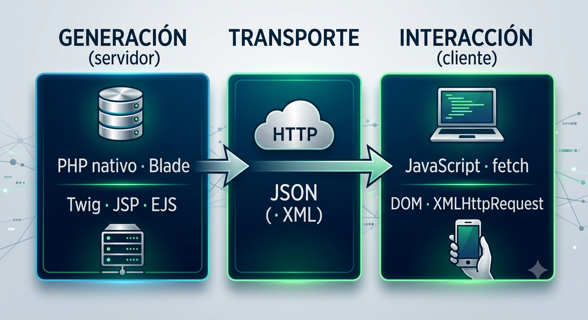

::: {.callout-important title="Normativa · RA-CE"}
Este bloque desarrolla el criterio **CE8.c** del RA8: identificar las tecnologías y frameworks relacionados con la generación por parte del servidor de páginas web con guiones embebidos.
:::

## El mapa tecnológico

Conviene ordenar el ecosistema en tres capas:

- **Generación en el servidor:** PHP nativo (`echo`, `include`, plantillas propias), motores de plantillas (Blade en Laravel, Twig en Symfony) y equivalentes en otros ecosistemas (JSP/Thymeleaf en Java, EJS en Node.js). Todos comparten el mismo principio ya conocido: lenguaje de marcas con código embebido.

- **Transporte de datos:** el protocolo HTTP y el formato JSON como lengua franca del intercambio, con XML como formato histórico aún presente en sistemas corporativos.

- **Interacción en el cliente:** JavaScript embebido en la página generada, con la API `fetch` como mecanismo estándar de obtención remota (sucesora del histórico objeto `XMLHttpRequest`, origen del término AJAX) y la API del DOM para modificar el documento.

{width=75% fig-align="center"}

<!--```text
   GENERACIÓN (servidor)      TRANSPORTE           INTERACCIÓN (cliente)
 ┌───────────────────────┐  ┌─────────────┐  ┌──────────────────────────┐
 │ PHP nativo · Blade   │  │ HTTP        │  │ JavaScript · fetch       │
 │ Twig · JSP · EJS      │─▶│ JSON (· XML)│─▶│ DOM · XMLHttpRequest     │
 └───────────────────────┘  └─────────────┘  └──────────────────────────┘
```-->

## De XMLHttpRequest a fetch: un poco de historia útil

El término **AJAX** (*Asynchronous JavaScript And XML*) se acuñó en 2005 para nombrar la técnica de pedir datos al servidor sin recargar, entonces basada en el objeto `XMLHttpRequest` y en XML como formato. Dos décadas después, la técnica es la misma pero las piezas han cambiado: `fetch` sustituye a `XMLHttpRequest` con una interfaz basada en promesas, y JSON ha desplazado a XML por su ligereza y su encaje natural con JavaScript.

```text
 1999                2005                 2015 →  hoy
 XMLHttpRequest ───▶ se acuña "AJAX" ───▶ fetch (promesas) + JSON
 (IE5, propietario)  (XHR + XML)          estándar actual
```

Encontrarás `XMLHttpRequest` en código heredado; en código nuevo, `fetch` es el estándar.

## JSON en PHP: json_encode y json_decode

PHP incorpora de serie la conversión entre sus estructuras (arrays y objetos) y JSON. Es la pieza que convierte cualquier script PHP en un posible endpoint.

**Serializar** (de PHP a JSON):

```php
<?php
$pelicula = [
    'titulo'   => 'Dune: Parte Tres',
    'genero'   => 'Ciencia ficción',
    'duracion' => 165,
    'sesiones' => ['16:00', '19:30', '22:45']
];
echo json_encode($pelicula, JSON_UNESCAPED_UNICODE);
```

Salida:

```text
{"titulo":"Dune: Parte Tres","genero":"Ciencia ficción","duracion":165,"sesiones":["16:00","19:30","22:45"]}
```

**Deserializar** (de JSON a PHP):

```php
<?php
$json  = '{"titulo":"Alien: Origen","duracion":118}';
$datos = json_decode($json, true);   // true => array asociativo
echo $datos['titulo'], ' dura ', $datos['duracion'], ' minutos';
```

Salida:

```text
Alien: Origen dura 118 minutos
```

Dos detalles importan en la práctica: `JSON_UNESCAPED_UNICODE` evita que las tildes se codifiquen como secuencias `\uXXXX`, y el segundo parámetro `true` de `json_decode` devuelve arrays asociativos en lugar de objetos `stdClass`, más cómodos con lo aprendido en UD3. Compara ambas salidas:

```php
<?php
$pelicula = ['titulo' => 'Añorados años'];

echo json_encode($pelicula), "\n";                          // sin flag
echo json_encode($pelicula, JSON_UNESCAPED_UNICODE), "\n";  // con flag

$obj = json_decode('{"nota": 8.7}');        // sin true => stdClass
$arr = json_decode('{"nota": 8.7}', true);  // con true => array
echo $obj->nota, ' = ', $arr['nota'];
```

Salida:

```text
{"titulo":"A\u00f1orados a\u00f1os"}
{"titulo":"Añorados años"}
8.7 = 8.7
```

Los arrays anidados se serializan sin trabajo adicional, lo que permite exponer estructuras completas de un plumazo:

```php
<?php
$cartelera = [
    ['id' => 1, 'titulo' => 'Dune: Parte Tres',  'nota' => 8.7],
    ['id' => 2, 'titulo' => 'Torrente 6',        'nota' => 5.9],
];
echo json_encode($cartelera, JSON_UNESCAPED_UNICODE | JSON_PRETTY_PRINT);
```

Salida:

```text
[
    {
        "id": 1,
        "titulo": "Dune: Parte Tres",
        "nota": 8.7
    },
    {
        "id": 2,
        "titulo": "Torrente 6",
        "nota": 5.9
    }
]
```

::: {.callout-tip title="Analogía Java"}
En Java, serializar a JSON exige una librería (Jackson, Gson) y normalmente una clase POJO con getters. En PHP no hay nada que configurar: `json_encode()` acepta directamente cualquier array asociativo, y `json_decode(..., true)` devuelve otro array sin necesidad de definir una clase destino. Es la consecuencia natural del tipado dinámico: donde Java exige un `ObjectMapper.readValue(json, Pelicula.class)`, PHP se conforma con `json_decode($json, true)`.
:::

## Plantillas en PHP nativo y comparativa con Blade

Generar la página inicial sigue siendo tarea del servidor. En PHP nativo, la separación de presentación se consigue con las inclusiones vistas en la UD4 (`require` de cabecera y pie) y fragmentos de plantilla que reciben datos. Blade, ya conocido de la UD5, industrializa exactamente esa idea. La comparativa es directa:

| Necesidad | PHP nativo | Blade (Laravel) |
|--------------------|---------------------------------|------------------------|
| Mostrar variable escapada | `<?= htmlspecialchars($t) ?>` | `{{ $t }}` |
| Recorrer colección | `<?php foreach ($ps as $p): ?>` | `@foreach ($ps as $p)` |
| Reutilizar cabecera/pie | `require 'header.php';` | `@extends('layout')` |
| Fragmento parametrizado | `include` con variables en ámbito | `@include('card', [...])` |
| Condicional | `<?php if ($vip): ?>` | `@if ($vip)` |

El mismo fragmento de cartelera, escrito en las dos tecnologías:

```php
<!-- PHP nativo: cartelera.php -->
<?php foreach ($peliculas as $p): ?>
  <article>
    <h3><?= htmlspecialchars($p['titulo']) ?></h3>
    <?php if ($p['nota'] >= 8): ?><span>TOP</span><?php endif; ?>
  </article>
<?php endforeach; ?>
```

```php
{{-- Blade: cartelera.blade.php --}}
@foreach ($peliculas as $p)
  <article>
    <h3>{{ $p['titulo'] }}</h3>
    @if ($p['nota'] >= 8)<span>TOP</span>@endif
  </article>
@endforeach
```

Ambos producen exactamente el mismo HTML. En esta unidad se trabaja con **PHP nativo**, que es la pila evaluable del módulo en generación de páginas; Blade se mantiene como referencia comparativa para reconocer que el concepto de framework de plantillas es transversal a todos los ecosistemas.

::: {.ejercicio}
**EJ3 · Clasificación por capas**

Clasifica las siguientes tecnologías en las tres capas del mapa tecnológico (generación en servidor, transporte, interacción en cliente): `Blade`, `fetch`, `JSON`, `Twig`, `DOM`, `HTTP`, `XMLHttpRequest`, `JSP`, `XML`, `PHP nativo`.

Añade una tecnología más por capa que no haya aparecido en la unidad, buscando en la documentación.
:::

::: {.ejercicio}
**EJ4 · Ficha de tecnologías y frameworks** — CE8.c

Elabora una ficha técnica (máximo dos caras) del ecosistema de generación dinámica interactiva. Debe contener:

1. El mapa de las tres capas con al menos **ocho tecnologías** correctamente situadas.
2. Una línea temporal `XMLHttpRequest` → AJAX → `fetch` con las fechas clave.
3. La comparativa PHP nativo / Blade con **un ejemplo de código propio** (no copiado de los apuntes) por cada fila.
4. Un párrafo argumentando qué combinación elegirías para un proyecto nuevo y por qué.
:::
