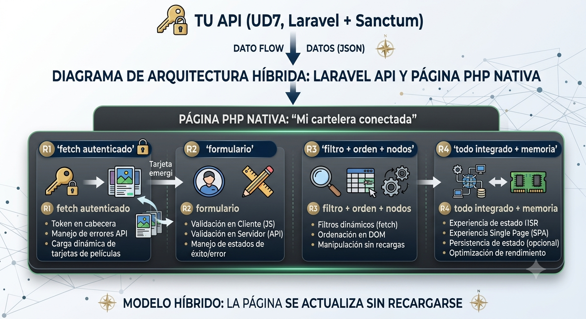

::: {.callout-important title="Normativa · RA-CE"}
Este bloque desarrolla el criterio **CE8.g** del RA8 (aplicar estas tecnologías y frameworks en la programación de aplicaciones web), integrando además CE8.d, CE8.e y CE8.f.
:::

El bloque final no introduce técnicas nuevas: exige **aplicarlas juntas**. El proyecto E7 reproduce el flujo de trabajo profesional completo de esta unidad —página generada en servidor, datos remotos, formulario verificado en dos capas y estructura viva— sobre la API construida por cada estudiante en la UD7.

{width=75% fig-align="center"}

<!--```text
        TU API (UD7, Laravel + Sanctum)
                    │ JSON
                    ▼
┌───────────────────────────────────────────────┐
│  Página PHP nativa  "Mi cartelera conectada" │
│                                              │
│  R1 fetch autenticado ──▶ tarjetas           │
│  R2 formulario ──▶ validación 2 capas        │
│  R3 filtro + orden + nodos, sin recargas     │
│  R4 todo integrado + memoria                 │
└───────────────────────────────────────────────┘
```-->

::: {.ejercicio}
**EJ12 · Proyecto integrador: "Mi cartelera conectada"** — CE8.d, CE8.e, CE8.f, CE8.g

Construye una aplicación web híbrida completa, en PHP nativo más JavaScript instrumental, conectada a tu API de la UD7, que cumpla los cuatro requisitos siguientes:

**R1 — Obtención remota (CE8.d).** La página principal, generada con PHP, carga mediante `fetch` el listado del recurso principal de tu API con autenticación Sanctum, con tratamiento diferenciado de los errores 401 y de red.

**R2 — Verificación en dos capas (CE8.e).** Un formulario de alta o de comentario validado en cliente (HTML5 + Constraint Validation API) y en servidor (endpoint con respuesta 201/422), con los errores del servidor pintados campo a campo.

**R3 — Estructura dinámica (CE8.f).** Al menos un filtrado y una ordenación sobre los datos ya cargados, más una inserción o eliminación de nodos, todo sin recargar.

**R4 — Aplicación completa (CE8.g).** Las tres piezas integradas en una única aplicación coherente, con el código comentado y una **memoria breve** (una cara) que indique qué se ejecuta en el servidor, qué en el cliente y por qué.
:::

::: {.callout-important title="Entrega "}
Enlace a GitHub con la aplicación y la memoria (es obligatoria).
:::