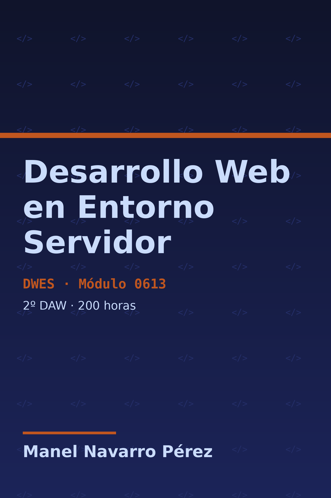

# Presentación del módulo {.unnumbered}

{width=38% fig-align="center"}

Bienvenido/a a los apuntes del módulo **Desarrollo Web en Entorno Servidor** (DWES, código 0613) de 2º curso del ciclo formativo de grado superior de **Desarrollo de Aplicaciones Web** (DAW).

| | |
|---|---|
| **Duración** | 200 horas (6 h/semana) |
| **Equivalencia** | 12 créditos ECTS |
| **Lenguaje principal** | PHP 8.2+ |
| **Framework** | Laravel 12.x |
| **Acceso a datos** | PDO |

: Ficha del módulo {tbl-colwidths="[30,70]"}

::: {.callout-important title="Marco normativo"}
Los Resultados de Aprendizaje (RA) y Criterios de Evaluación (CE) del módulo están fijados por el **RD 686/2010** (Anexo II, módulo 0613). El currículo vigente en la Comunitat Valenciana se establece en el **Decreto 114/2025** (DOGV).
:::

## Estructura del módulo {.unnumbered}

El módulo se organiza en **9 unidades didácticas**, cada una asociada a un Resultado de Aprendizaje:

| UD | Título | RA | Horas |
|:--:|--------|:--:|:-----:|
| 1 | Arquitecturas y tecnologías web en servidor | RA1 | 14 |
| 2 | Inserción de código PHP en páginas web | RA2 | 17 |
| 3 | Estructuras de programación, funciones y formularios | RA3 | 19 |
| 4 | POO en PHP: autenticación, sesiones y cookies | RA4 | 36 |
| 5 | Separación de la lógica de negocio: MVC con Laravel | RA5 | 30 |
| 6 | Acceso a almacenes de datos con PDO | RA6 | 32 |
| 7 | Servicios web REST | RA7 | 22 |
| 8 | Páginas web dinámicas e interactivas | RA8 | 18 |
| 9 | Aplicaciones web híbridas: Composer y repositorios heterogéneos | RA9 | 12 |

: Distribución de unidades (200 h totales)

## Cómo usar estos apuntes {.unnumbered}

- La **teoría y los ejercicios** están intercalados: practica cada concepto justo después de estudiarlo.
- Los bloques de código PHP son **completos y ejecutables**: cópialos y pruébalos en tu entorno.
- Las cajas de color tienen un significado fijo en todo el libro:

::: {.callout-note title="Concepto clave"}
Definiciones y fundamentos que debes dominar.
:::

::: {.callout-tip title="Analogía Java"}
Puentes con lo que ya conoces de la programación Java de 1º curso.
:::

::: {.callout-warning title="Errores frecuentes"}
Trampas habituales y cómo evitarlas.
:::

::: {.callout-important title="Normativa · RA-CE"}
Vinculación del contenido con los Criterios de Evaluación oficiales.
:::

En la página de [Descargas](descargas.qmd) tienes el libro completo y cada unidad en **PDF** y **EPUB**.

---

*Estos materiales se publican bajo licencia [CC BY-NC-SA 4.0](https://creativecommons.org/licenses/by-nc-sa/4.0/deed.es).*
